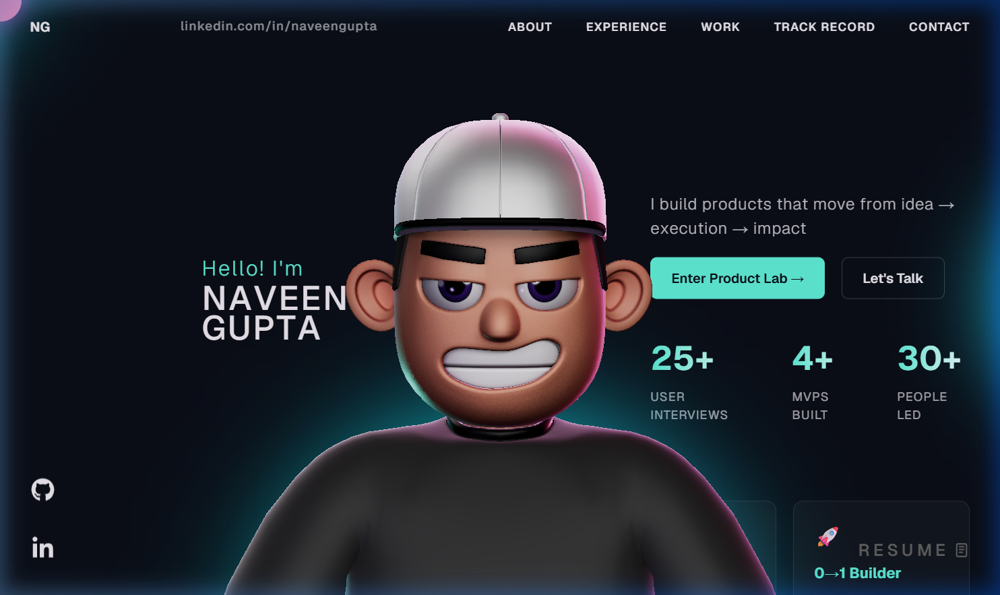

# 🎨 Naveen Gupta — Professional 3D Portfolio Website

This repository contains the source code for my personal 3D portfolio website built with **React**, **TypeScript**, **Three.js (React Three Fiber)**, and **GSAP**. 

It features an interactive 3D character model, beautiful scroll-linked animations, standard-compliant grid layouts, smooth lenis scrolling, and a fully polished mobile-responsive experience built for modern devices.

🌐 **Live Site:** [https://naveengupta-26.github.io/Portfolio/](https://naveengupta-26.github.io/Portfolio/)



---

## ✨ Features

- **3D Character Model**: Interactive character model loaded with React Three Fiber, featuring custom dynamic backlight, mouse-linked movements, and scroll triggers.
- **GSAP Animations**: Fluid entry, exit, and scroll-linked timeline animations (ScrollTrigger) to bring each section to life.
- **Lenis Smooth Scroll**: Unified high-performance smooth scrolling across both desktop and mobile layouts.
- **Universal Mobile Responsiveness**: Redesigned to stack beautifully on all viewport sizes (tested on iPhone/Android) with a customized hamburger glassmorphism overlay menu.
- **Dynamic Content Sections**:
  - **About**: Clear overview of core mindsets with hover effects.
  - **Experience**: Clean timeline layout showcasing operations, product leadership, and past achievements.
  - **Work**: Distinctive interactive product showcases.
  - **Track Record**: Highlighted stats and metrics in a single/multi-column grid.
  - **Contact**: Fast links to GitHub, LinkedIn, and email address with word-wrap support.
  - **Resume floating pill**: Seamless floating glassmorphic resume access in the bottom right corner.

---

## 🛠️ Tech Stack

- **Framework**: React 18 + TypeScript + Vite
- **3D Renderers**: Three.js + `@react-three/fiber` + `@react-three/drei`
- **Animations**: GSAP + `@gsap/react`
- **Styling**: Vanilla CSS (Modular design system)
- **Supporting**: `react-icons`, `react-fast-marquee`, `@vercel/analytics`

---

## 📂 Project Structure

```text
.
├── .github/workflows/         # Auto-deployment Actions (CI/CD pipeline)
├── public/                    # Static assets (3D models, PDF resume, images)
│   ├── images/                # Asset pictures and project screenshots
│   └── models/                # 3D models and character assets
├── src/
│   ├── components/            # Reusable section and interactive components
│   │   ├── Character/         # 3D character scene and decrypt utilities
│   │   ├── styles/            # Individual component stylesheets
│   │   └── utils/             # GSAP timeline triggers & initial effect handlers
│   ├── context/               # Global scroll and loading providers
│   ├── App.tsx                # Layout entrypoint
│   └── main.tsx               # App entrypoint
├── package.json
└── vite.config.ts
```

---

## 🚀 Getting Started

### Prerequisites
- Node.js (v18+)
- npm

### Local Setup

1. **Clone the repository**:
   ```bash
   git clone https://github.com/NaveenGupta-26/Portfolio.git
   cd Portfolio
   ```

2. **Install dependencies**:
   ```bash
   npm install
   ```

3. **Start the local development server**:
   ```bash
   npm run dev
   ```

4. Open `http://localhost:5173/` in your browser.

---

## 📦 Deployment (CI/CD)

The repository has been automated to deploy on **GitHub Pages** instantly using **GitHub Actions**.

Whenever you push to the `main` branch:
1. GitHub automatically downloads Node.js, installs dependencies, and builds the static assets.
2. The generated production build inside `dist/` is automatically uploaded to GitHub Pages.
3. Your live portfolio is refreshed instantly at `https://naveengupta-26.github.io/Portfolio/`.

---

## 📝 License

This project is open-source and available under the [MIT License](LICENSE).
